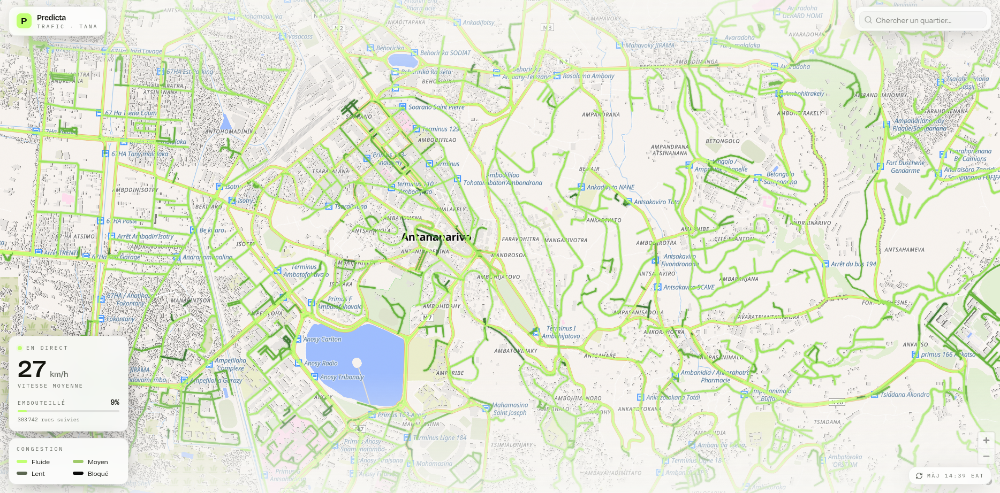

<div align="center">


# Predicta API

**Real-time road-traffic API for Antananarivo, Madagascar.**

[](https://github.com/Tiavina-Andriamamivony/predictaapi/actions/workflows/ci.yml)
[](LICENSE.txt)
[](https://openjdk.org/projects/jdk/21/)
[](https://spring.io/projects/spring-boot)

</div>

## What is Predicta

Predicta serves **live road-congestion data for Antananarivo** as GeoJSON. It fetches Mapbox
Vector Tiles from an external traffic source, decodes and reprojects them to WGS84 on the fly, and
enriches each road segment with its OpenStreetMap quartier and name — **no traffic is ever stored**.
A companion quartier search lets clients recenter the map on any of the city's 372 neighbourhoods.

This is the **only backend** for Predicta. It runs as a single AWS Lambda behind API Gateway.

<div align="center">

</div>

## Where to get it

```sh
git clone git@github.com:Tiavina-Andriamamivony/predictaapi.git
cd predictaapi
./gradlew bootRun    # runs on http://localhost:8080 (needs PostgreSQL, see below)
```

## Endpoints

| Method | Path | Auth | Description |
|--------|------|------|-------------|
| `GET` | `/traffic` | API key | Live Antananarivo traffic as a GeoJSON `FeatureCollection` |
| `GET` | `/quartiers?q=` | API key | Search Tana quartiers by name substring (returns name + centroid) |
| `GET` | `/ping` | Open | Healthcheck — returns `"pong"` |
| `GET` | `/health/email?to=` | Open | Send test emails to verify the SES pipeline |

- **Auth:** pass your key in the `X-API-Key` header. Keys live in the `applications` table.
- **Docs:** Swagger UI at `/swagger-ui.html`, OpenAPI spec at `/v3/api-docs` (also `doc/api.yml`).

## How traffic works

```
TileGridSourceCentered   disk grid of tiles around the Tana center (radius in tiles)
        │
TileFetcherHttp          fetch each .pbf in parallel, auto-gunzip
        │
MvtToGeoJsonConverter    hand-decode the MVT geometry stream → WGS84, keep the "speeds" layer
        │
OsmEnricher              add quartierId + fill road names (best-effort)
        │
        ▼
   GeoJSON FeatureCollection   (gzipped on the way out to stay under the Lambda 6 MB cap)
```

Each `speeds` feature carries `name`, `quartierId`, `speed` (km/h) and `rate` (congestion ratio).
The pipeline is **best-effort**: a tile that fails to fetch is skipped (warn log) and the response
sets `X-Predicta-Partial: true`. The tile-URL template is **not committed** — supply it via the
`SCRAPE_TILE_TEMPLATE` env var (placeholders `{x} {y} {zoom}`).

## Build and run

```sh
./gradlew build                 # compile + test + jacoco verify
./gradlew test                  # run all tests (JUnit 5, parallel forks)
./gradlew test --tests com.predicta.mg.conf.FacadeIT   # a single test class
./gradlew bootRun               # run locally (needs PostgreSQL on localhost:5432, db=predicta)
./format.sh                     # google-java-format over all src/**/*.java
```

**Prerequisites:** JDK 21, Docker (for Testcontainers integration tests), PostgreSQL.

## Persistence

- **Flyway** owns the schema — migrations run at boot before Hibernate.
- `V1__quartiers.sql` seeds 372 Antananarivo quartiers (OSM admin polygons + Voronoi cells), keeping only name + centroid.
- `V2__applications.sql` creates the `applications` table for API-key auth.
- `ddl-auto=update` is on — `@Entity` classes must match the Flyway-created tables exactly.
- **Traffic itself is never persisted.**

## Project structure

```
src/main/java/com/predicta/mg/
  PojaApplication.java              Spring Boot entry point
  handler/LambdaHandler.java        AWS Lambda entry point
  endpoint/mvt/                     GET /traffic, GET /quartiers
  models/                           TileGridSourceCentered, TileFetcherHttp, records
  services/traffic/                 TrafficService + MvtToGeoJsonConverter (+ geojson/, osm/)
  conf/                             RestTemplate, gzip filter, ScrapeProps, OpenAPI
src/main/resources/
  application.properties
  db/migration/                     V1__quartiers.sql, V2__applications.sql
doc/api.yml                         OpenAPI 3.0.3 spec
```

## Contributing

New here? Start with [ONBOARDING.md](ONBOARDING.md). Code comments and logs are in French — keep
that convention. Run `./format.sh` and `./gradlew build` before opening a PR.

## License

[MIT](LICENSE.txt) © Predicta
